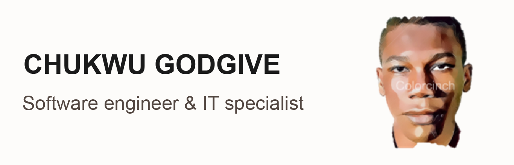

<!-- Greetings -->
<h2>Hi, I'm Chukwu Godgive 👋🏾</h2>

<!-- Lead Profile -->

    

<!-- Intro section -->

    

        I am a computer science graduate with a passion for IT and software development. With a proven ability to learn new technologies quickly and apply them to solve problems. I'm seeking an entry-level to middle-level position in a fast-paced, innovative environment. Some technologies I enjoy working with include MERN Stack(Mongodb, Express, ReactJS + Nodejs) and Jamstack(JavaScript, APIs + Markup). 👩🏾‍💻
    

    

         
    

<!-- Contact page -->

    <h3>Connect with me :</h3>
    
    
    

<!-- Languages and tools section -->

    <h3>Languages and Tools :</h3>
    
    
    
    
    
    
     
    
       
        
    
    
      
    
     
    

<!-- Support Section -->

    <h3>Support :</h3>
    

